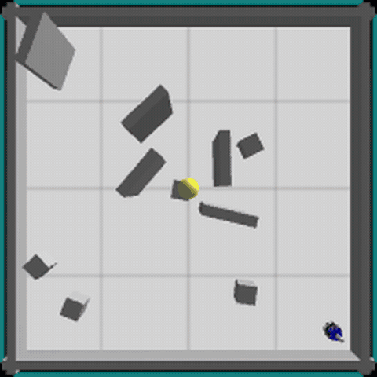
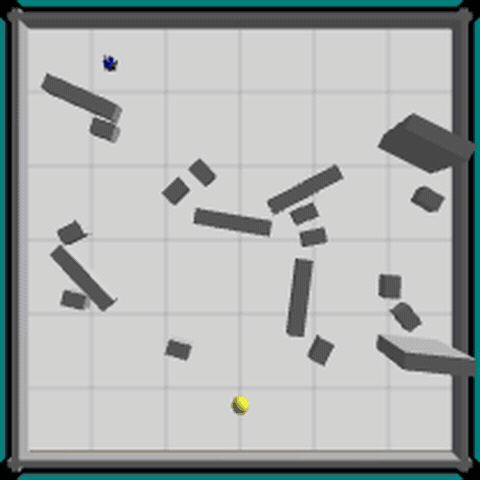
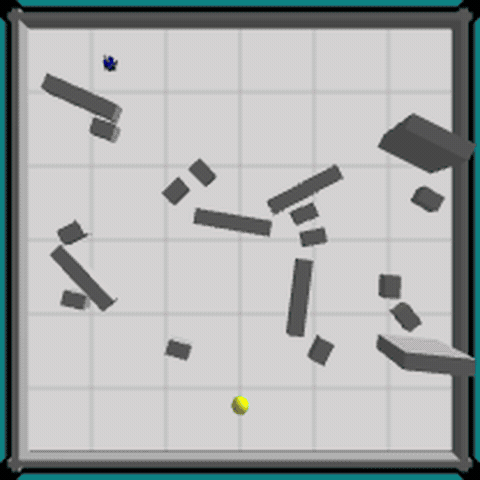
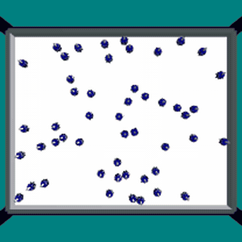

# ARGoS swarm robotics

[](https://github.com/davidcohenDC/argos-swarm-robotics/actions/workflows/build.yml)
[](https://github.com/davidcohenDC/argos-swarm-robotics/releases/latest)
[](LICENSE)

Four foot-bot controllers in Lua for the [ARGoS](https://www.argos-sim.info/)
simulator, one per lab of the Intelligent Robotic Systems course at the
University of Bologna (2023/24). The task is the same for the first three labs
— reach the light without hitting anything — solved with a different control
architecture each time; the fourth puts fifty robots in the arena and asks them
to find each other with nothing but local messages.

I keep the controllers and the reports here exactly as I handed them in. The
GIFs below are recorded from ARGoS itself, see [Run it](#run-it).

<table>
  <tr>
    <td align="center"><br><sub>1 · reactive controller</sub></td>
    <td align="center"><br><sub>2 · subsumption</sub></td>
  </tr>
  <tr>
    <td align="center"><br><sub>3 · motor schemas</sub></td>
    <td align="center"><br><sub>4 · swarm aggregation</sub></td>
  </tr>
</table>

## What they do

The robot has 24 proximity sensors, 24 light sensors, two wheels and, in lab 4,
a range-and-bearing radio (10-byte messages, line of sight). No map, no
position.

- **[01-reactive-controller](01-reactive-controller)** — three behaviours,
  obstacle avoidance, phototaxis and random walk, with the priority written in
  `step()`: the first one that has something to do wins.
- **[02-subsumption](02-subsumption)** — same behaviours as layers of a
  subsumption architecture. Each one is a module with `condition()` and
  `execute()`, kept in a priority queue; the highest layer whose condition holds
  takes the wheels. Wandering became probabilistic instead of step-counted.
- **[03-motor-schemas](03-motor-schemas)** — no arbitration: attraction to the
  light, repulsion from obstacles, noise and repulsion from the robot's own
  recent positions are vectors, summed with weights and turned into wheel
  speeds. A small uniform field keeps it moving when everything else is weak,
  and a light threshold switches between an aggressive mix and an exploratory
  one that follows walls. All weights are in `config.lua`.
- **[04-swarm-aggregation](04-swarm-aggregation)** — every robot is a WALK/STOP
  automaton on top of the lab-2 stack. It broadcasts its state and counts the
  stopped neighbours `N` it hears, then stops with probability
  `min(PsMax, S + α·N)` and leaves with probability `max(PwMin, W − β·N)`.
  Green LEDs walking, yellow while avoiding, red stopped. Parameters come from the environment,
  defaults in `hyperparameters.lua`.

Each folder has the `Report.pdf` I wrote for it. Labs 2 to 4 also have a
`test/` folder with the script that ran the experiments headless and the
Python that made the plots: 500 runs for lab 2, 300 runs plus a Mann–Whitney
test on the seeds for lab 3, an 81-combination sweep of α, β, S, W for lab 4
(best set 27 cm mean distance between neighbours, worst above 50; small
changes in the parameters move the result a lot, and the report says so).

## Run it

You need Docker. Then:

```sh
git clone https://github.com/davidcohenDC/argos-swarm-robotics.git
cd argos-swarm-robotics
docker compose run --rm argos scripts/run.sh 04-swarm-aggregation
```

The first run builds ARGoS from source inside the image (a few minutes, once).
The command runs the lab for 3000 ticks without a window and prints what the
controller logs at the end: the final distance to the light for labs 2 and 3,
the mean distance between neighbours for lab 4. `scripts/run.sh all 300` runs
every lab for 300 ticks, which is what the CI does. Lab 4 takes its parameters
from the environment: `ALPHA=0.05 docker compose run --rm argos scripts/run.sh
04-swarm-aggregation`.

To watch them, install [ARGoS 3](https://www.argos-sim.info/core.php) and open
the arena of any lab:

```sh
cd 02-subsumption
argos3 -c test-subs.argos
```

The GIFs come from `scripts/record.sh <lab>`, which runs the same arena under
Xvfb with ARGoS' frame grabbing and hands the frames to ffmpeg. The 2024
`.argos` files are never modified: both scripts write a temporary copy next to
them with the length, the seed, the camera and no window.

Prefer not to clone? Each
[release](https://github.com/davidcohenDC/argos-swarm-robotics/releases/latest)
ships a zip with everything.

## How it is organised

```
01-reactive-controller/   task_one.lua, utilities.lua, proximity.lua, task_one.argos
02-subsumption/           task_two.lua, lib/behaviours/, lib/priority_queue.lua, test-subs.argos, test/
03-motor-schemas/         controller-motor_schemas.lua, lib/schemas/, config.lua, motor_schemas.argos, test/
04-swarm-aggregation/     aggregation.lua, lib/behaviours/, lib/rab.lua, hyperparameters.lua, aggregation.argos, test/
scripts/                  run.sh (headless run), record.sh (GIFs)
Dockerfile, compose.yaml  ARGoS built from source at a pinned commit, plus Xvfb and ffmpeg
```

Each lab was its own repository. The four histories were rewritten into their
folders and merged here, so `git log` and `git blame` inside a folder still
reach the original 2024 commits.

## Since 2024

The Lua code, the arenas and the reports are untouched. In 2026 I merged the
four repositories into this one, added the Docker image (ARGoS is not packaged
for current Ubuntu releases), the two scripts, a CI that syntax-checks every
Lua file and runs all four labs in the image, and semantic-release to publish
it. The assignment sheets are not included, they belong to the course.

## License

[MIT](LICENSE) © 2024 David Cohen
